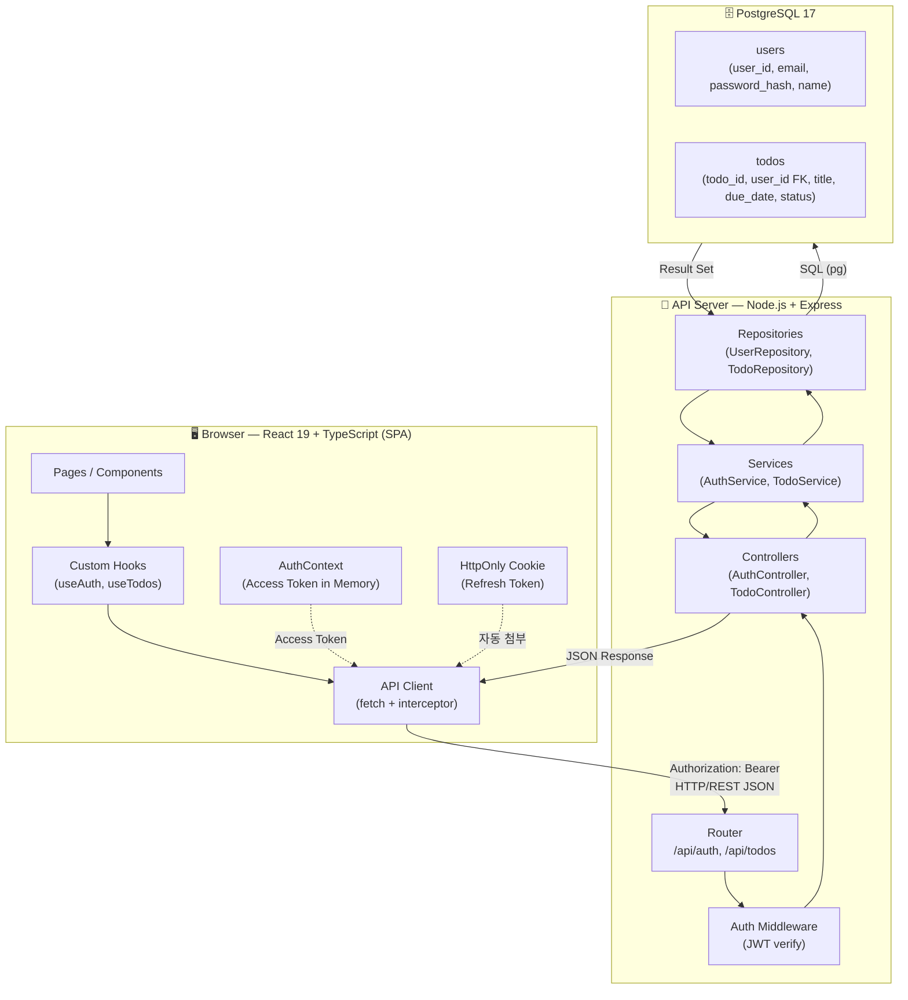
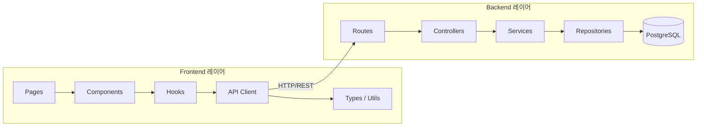
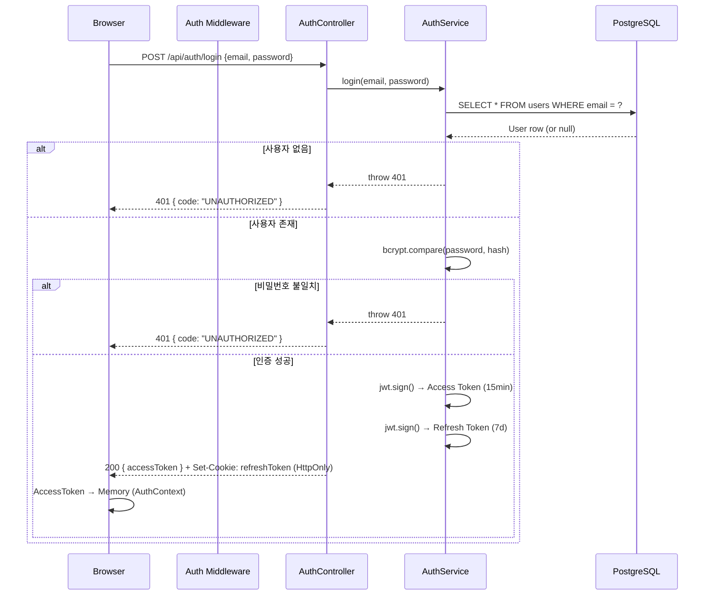
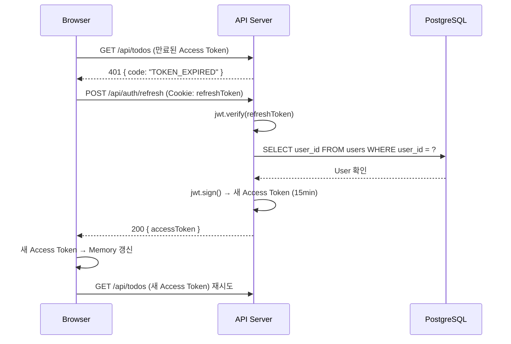
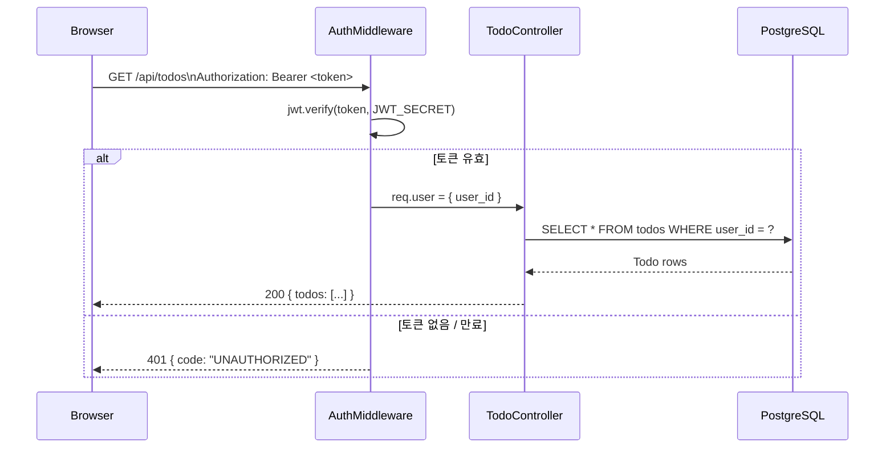
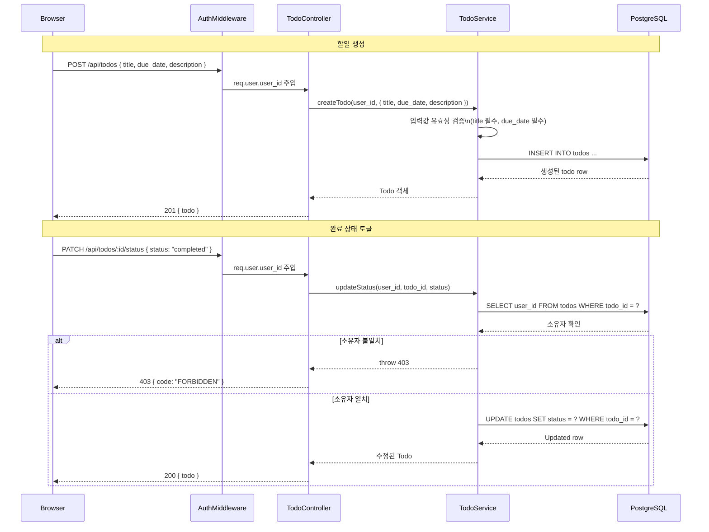
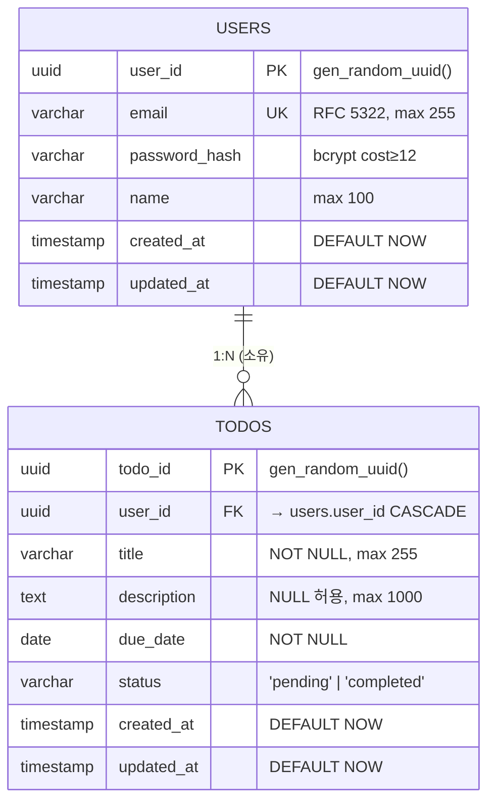
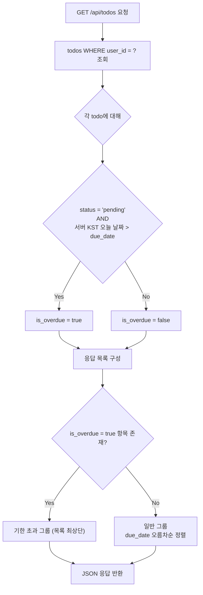

# 기술 아키텍처 다이어그램 - my_todolist (Team CalTalk)

**작성일**: 2026-02-11 | **버전**: 1.1 | **상태**: Draft

---

## 1. 시스템 개요

3-tier 아키텍처의 각 계층 내부 구성요소와 통신 방식을 포함한 전체 구조도.

---

## 2. 레이어 의존성 구조

Frontend와 Backend 각각의 레이어 간 단방향 의존성 규칙.

---

## 3. 인증 흐름

### 3-1. 로그인 및 토큰 발급

### 3-2. Access Token 만료 시 갱신

### 3-3. 보호된 API 요청 흐름 (인증 미들웨어)

---

## 4. 할일 CRUD 흐름

핵심 할일 생성 및 상태 변경 흐름.

---

## 5. 데이터 모델 (ER Diagram)

**인덱스**:
- `idx_todos_user_id` — todos(user_id)
- `idx_todos_due_date` — todos(due_date)
- `idx_todos_status` — todos(status)

---

## 6. 마감 기한 경과 판정 로직

`is_overdue`는 DB 컬럼이 아닌 API 응답 시 서버에서 런타임 계산.

---

## 변경 이력

| 버전 | 날짜 | 내용 |
|------|------|------|
| 1.0 | 2026-02-11 | 최초 작성 |
| 1.1 | 2026-02-11 | 구체화 — 레이어 내부 컴포넌트, 토큰 갱신 흐름, CRUD 시퀀스, is_overdue 판정 로직 추가 |
