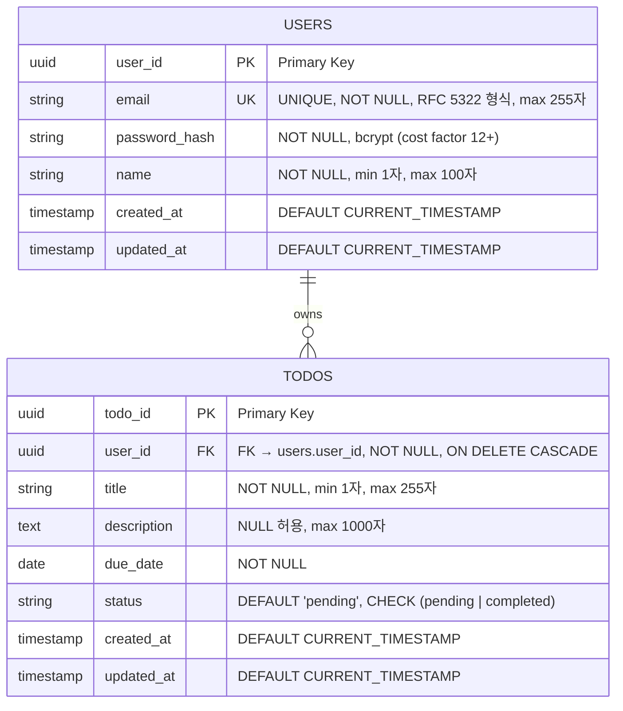
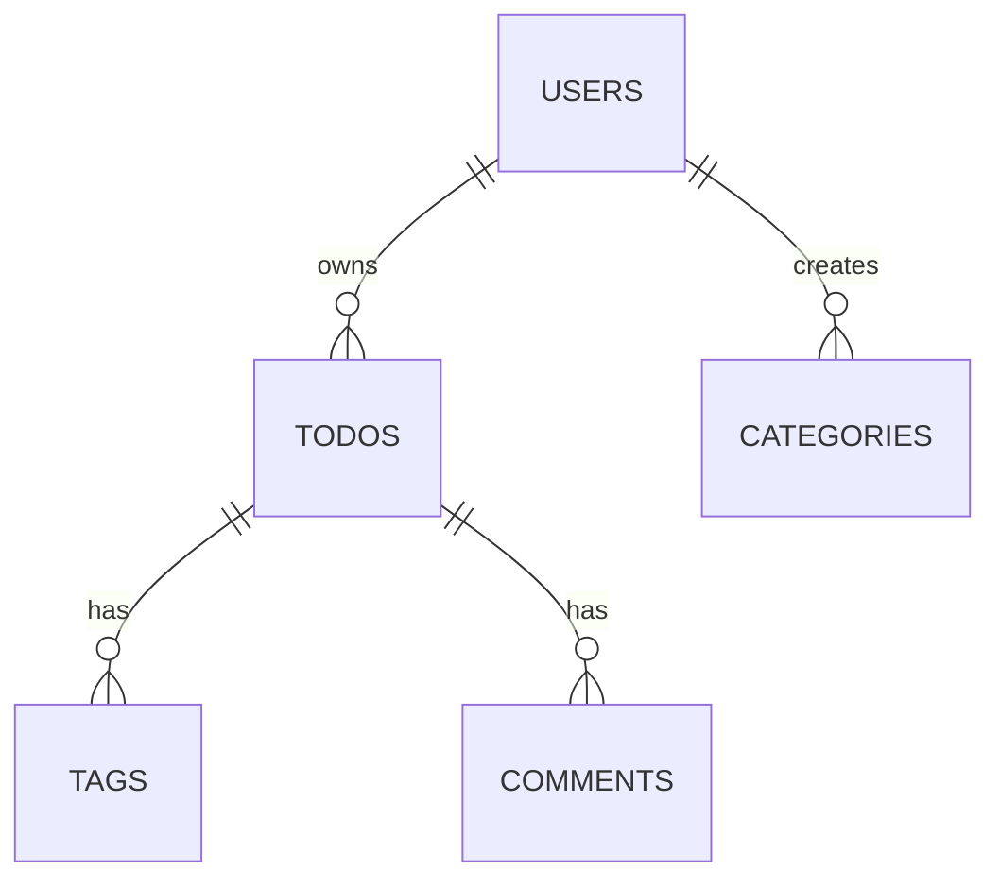

# ERD - my_todolist (Team CalTalk)

**작성일**: 2026-02-11 | **버전**: 1.0 | **상태**: Draft

**기반 문서**:
- `docs/1-domain-definition.md` (v1.2, 2026-02-10)
- `docs/2-prd.md` (v1.3, 2026-02-10)

---

## 1. Entity-Relationship Diagram (Mermaid erDiagram)



### 다이어그램 설명

- **관계**: USERS(1) ←→ TODOS(N) — 한 사용자는 여러 할일 소유
- **카디널리티**: `||--o{` 표기 (1:N 관계)
  - `||` : USERS는 하나
  - `--o{` : TODOS는 여럿
- **Primary Key (PK)**: user_id, todo_id
- **Foreign Key (FK)**: todos.user_id → users.user_id
- **Unique Key (UK)**: users.email
- **제약조건**:
  - users.email: UNIQUE NOT NULL
  - users.password_hash: NOT NULL
  - users.name: NOT NULL
  - todos.user_id: NOT NULL + ON DELETE CASCADE
  - todos.title: NOT NULL
  - todos.due_date: NOT NULL
  - todos.status: CHECK (status IN ('pending', 'completed'))

---

## 2. 테이블 상세 명세

### 2.1 USERS 테이블

| 컬럼명 | 타입 | 제약조건 | 기본값 | 설명 |
|--------|------|---------|--------|------|
| `user_id` | UUID | PK, NOT NULL | gen_random_uuid() | 사용자 고유 식별자 |
| `email` | VARCHAR(255) | UNIQUE, NOT NULL | - | 로그인 이메일 (RFC 5322 형식, 중복 가입 방지) |
| `password_hash` | VARCHAR(255) | NOT NULL | - | bcrypt로 해시된 비밀번호 (cost factor 12 이상) |
| `name` | VARCHAR(100) | NOT NULL | - | 사용자 이름 (1~100자) |
| `created_at` | TIMESTAMP | NOT NULL | CURRENT_TIMESTAMP | 계정 생성 일시 |
| `updated_at` | TIMESTAMP | NOT NULL | CURRENT_TIMESTAMP | 계정 정보 수정 일시 |

**인덱스 전략**:
- `user_id`: PRIMARY KEY INDEX (자동)
- `email`: UNIQUE INDEX (자동)

---

### 2.2 TODOS 테이블

| 컬럼명 | 타입 | 제약조건 | 기본값 | 설명 |
|--------|------|---------|--------|------|
| `todo_id` | UUID | PK, NOT NULL | gen_random_uuid() | 할일 고유 식별자 |
| `user_id` | UUID | FK, NOT NULL | - | 소유자 (users.user_id 참조, CASCADE 삭제) |
| `title` | VARCHAR(255) | NOT NULL | - | 할일 제목 (1~255자) |
| `description` | TEXT | NULL 허용 | NULL | 할일 설명 (최대 1000자, 선택 입력) |
| `due_date` | DATE | NOT NULL | - | 마감일 (필수 입력, DATE 타입) |
| `status` | VARCHAR(20) | DEFAULT, CHECK | 'pending' | 상태 ('pending' 또는 'completed') |
| `created_at` | TIMESTAMP | NOT NULL | CURRENT_TIMESTAMP | 할일 생성 일시 |
| `updated_at` | TIMESTAMP | NOT NULL | CURRENT_TIMESTAMP | 할일 수정 일시 |

**제약조건**:
```sql
CONSTRAINT fk_todos_user_id
  FOREIGN KEY (user_id)
  REFERENCES users(user_id)
  ON DELETE CASCADE

CONSTRAINT chk_todos_status
  CHECK (status IN ('pending', 'completed'))
```

---

## 3. 관계 정의

### 3.1 관계 유형

| 항목 | 내용 |
|------|------|
| **관계명** | User ← owns → Todo |
| **카디널리티** | 1:N (One-to-Many) |
| **관계 방향** | 단방향 (부모 → 자식) |
| **선택성** | 필수 (Todo는 반드시 하나의 User에 속함) |

### 3.2 참조 무결성 (Referential Integrity)

**Foreign Key 정의**:
```sql
ALTER TABLE todos
ADD CONSTRAINT fk_todos_user_id
FOREIGN KEY (user_id)
REFERENCES users(user_id)
ON DELETE CASCADE;
```

**DELETE 액션**:
- **ON DELETE CASCADE**: 사용자 삭제 시 해당 사용자의 모든 할일 자동 삭제
- 목적: 사용자 탈퇴 시 고아 데이터(orphan records) 방지

**UPDATE 액션** (명시되지 않음):
- 기본값: ON UPDATE NO ACTION
- UUID는 변경되지 않으므로 실질적 영향 없음

### 3.3 소유권 규칙

| 규칙 | 설명 |
|------|------|
| **생성 시** | 할일은 생성한 사용자(JWT 토큰의 user_id)에 자동 귀속 |
| **조회** | 사용자는 자신의 할일(user_id 일치)만 조회 가능 |
| **수정** | 사용자는 자신의 할일만 수정 가능 (백엔드 검증 필수) |
| **삭제** | 사용자는 자신의 할일만 삭제 가능 (백엔드 검증 필수) |
| **미인증 접근** | 타인의 할일 접근 시 403 Forbidden 응답 |

---

## 4. 인덱스 전략

### 4.1 인덱스 명세

| 인덱스명 | 테이블 | 컬럼 | 인덱스 타입 | 목적 | 쿼리 최적화 |
|----------|--------|------|-----------|------|-----------|
| `pk_users_user_id` | users | user_id | PRIMARY | 기본 키 조회 및 FK 참조 | O(log N) 빠른 PK 조회 |
| `uk_users_email` | users | email | UNIQUE | 이메일 중복 검증, 로그인 조회 | O(log N) 빠른 이메일 검색 |
| `pk_todos_todo_id` | todos | todo_id | PRIMARY | 기본 키 조회 | O(log N) 빠른 할일 조회 |
| `idx_todos_user_id` | todos | user_id | BTREE | 사용자별 할일 목록 조회 | `SELECT * FROM todos WHERE user_id = ?` 빠른 필터링 |
| `idx_todos_due_date` | todos | due_date | BTREE | 마감일 기반 정렬 및 필터링 | 마감일 오름차순 정렬 시 빠른 스캔 |
| `idx_todos_status` | todos | status | BTREE | 상태별 필터링 | `WHERE status = 'pending'` 빠른 필터링 |

### 4.2 복합 인덱스 고려 (미래 최적화)

```sql
-- 향후 이터레이션에서 추가 고려 가능
-- 사용자별 + 상태별 조회 최적화
CREATE INDEX idx_todos_user_status ON todos(user_id, status);

-- 사용자별 + 마감일 정렬
CREATE INDEX idx_todos_user_due_date ON todos(user_id, due_date);
```

---

## 5. 비즈니스 규칙 요약

### 5.1 계산 필드 (Computed Field)

| 필드명 | 저장 위치 | 계산 방식 | 목적 |
|--------|---------|---------|------|
| `is_overdue` | DB 미저장 | 서버 KST(UTC+9) 오늘 날짜 > due_date AND status = 'pending' | 마감 기한 경과 판정 |

**구현 예시 (백엔드)**:
```javascript
// Node.js에서 KST 오늘 계산
const today = new Date().toLocaleDateString('en-CA', { timeZone: 'Asia/Seoul' });
// 2026-02-11 형식 (ISO 8601)

// SQL 쿼리
const isOverdue = todo.status === 'pending' && new Date(todo.due_date) < new Date(today);
```

**UI 표시**:
- `is_overdue = true` 항목: 목록 최상단 별도 그룹
- 시각 구분: 빨간 색상, 경고 아이콘

---

### 5.2 상태 전환 규칙

| FROM | TO | 트리거 | 설명 |
|------|----|----- --|------|
| `pending` | `completed` | 사용자 완료 처리 | 할일 완료 기록 |
| `completed` | `pending` | 사용자 되돌리기 | 완료 해제, 다시 미완료로 변경 |
| `*` | `*` | 수정 시 | 할일 수정 후 상태 유지 가능 |

**비즈니스 규칙**:
- 양방향 전환 가능 (완료 ↔ 미완료)
- 1회 클릭으로 즉시 상태 변경
- 상태 변경 시 `updated_at` 자동 갱신

---

### 5.3 이메일 유일성 규칙

| 제약 | 적용 대상 | 목적 | 검증 위치 |
|------|---------|------|---------|
| UNIQUE | users.email | 중복 가입 방지 | DB 레벨 + 애플리케이션 레벨 |

**검증 순서**:
1. 프론트엔드: RFC 5322 형식 검증 (클라이언트)
2. 백엔드: 정규식 + DB 쿼리 검증
3. DB: UNIQUE 제약 위반 시 에러 반환

**에러 처리**:
- 중복 이메일 가입 시도 시: 400 Bad Request
- 에러 메시지: "이미 사용 중인 이메일입니다."

---

### 5.4 CASCADE 삭제 규칙

| 시나리오 | 실행 | 결과 |
|---------|------|------|
| 사용자 삭제 | DELETE FROM users WHERE user_id = ? | 해당 사용자의 모든 할일 자동 삭제 |
| 할일 삭제 | DELETE FROM todos WHERE todo_id = ? | 해당 할일만 삭제, 사용자는 유지 |

**구현 로직**:
```sql
-- users 테이블에서 사용자 삭제
DELETE FROM users WHERE user_id = '550e8400-e29b-41d4-a716-446655440000';

-- 자동으로 cascade
-- → DELETE FROM todos WHERE user_id = '550e8400-e29b-41d4-a716-446655440000';
```

**데이터 보호**:
- 사용자 삭제 시 복구 불가능
- 관리자 인터페이스에서만 사용자 삭제 권한 제공 (MVP 범위 외)
- 개별 할일은 사용자에 의해 언제든 삭제 가능

---

### 5.5 입력 유효성 기준

#### 사용자(User) 필드

| 필드 | 타입 | 제약 | 검증 규칙 | 에러 코드 |
|------|------|------|----------|---------|
| `email` | VARCHAR(255) | UNIQUE, NOT NULL | RFC 5322 형식, max 255자 | INVALID_EMAIL |
| `password` | VARCHAR(255) | NOT NULL | 최소 8자, 영문+숫자 혼용 (저장 시 bcrypt 해시) | WEAK_PASSWORD |
| `name` | VARCHAR(100) | NOT NULL | 최소 1자, max 100자 | INVALID_NAME |

#### 할일(Todo) 필드

| 필드 | 타입 | 제약 | 검증 규칙 | 에러 코드 |
|------|------|------|----------|---------|
| `title` | VARCHAR(255) | NOT NULL | 최소 1자, max 255자 | INVALID_TITLE |
| `description` | TEXT | NULL 허용 | max 1000자 | INVALID_DESCRIPTION |
| `due_date` | DATE | NOT NULL | 유효한 DATE 형식 (YYYY-MM-DD) | INVALID_DATE |
| `status` | VARCHAR(20) | DEFAULT | 'pending' 또는 'completed' | INVALID_STATUS |

**검증 스택**:
1. **클라이언트**: HTML5 폼 검증 + JavaScript 유효성 검사
2. **백엔드**: Express 미들웨어 (body validation)
3. **데이터베이스**: CHECK 제약, 타입 검증

---

## 6. 데이터베이스 초기화 스크립트

### 6.1 테이블 생성 (PostgreSQL 17)

```sql
-- 사용자 테이블
CREATE TABLE users (
  user_id       UUID         PRIMARY KEY DEFAULT gen_random_uuid(),
  email         VARCHAR(255) UNIQUE NOT NULL,
  password_hash VARCHAR(255) NOT NULL,
  name          VARCHAR(100) NOT NULL,
  created_at    TIMESTAMP    DEFAULT CURRENT_TIMESTAMP,
  updated_at    TIMESTAMP    DEFAULT CURRENT_TIMESTAMP
);

-- 할일 테이블
CREATE TABLE todos (
  todo_id     UUID         PRIMARY KEY DEFAULT gen_random_uuid(),
  user_id     UUID         NOT NULL REFERENCES users(user_id) ON DELETE CASCADE,
  title       VARCHAR(255) NOT NULL,
  description TEXT,
  due_date    DATE         NOT NULL,
  status      VARCHAR(20)  DEFAULT 'pending' CHECK (status IN ('pending', 'completed')),
  created_at  TIMESTAMP    DEFAULT CURRENT_TIMESTAMP,
  updated_at  TIMESTAMP    DEFAULT CURRENT_TIMESTAMP
);

-- 인덱스 생성
CREATE INDEX idx_todos_user_id ON todos(user_id);
CREATE INDEX idx_todos_due_date ON todos(due_date);
CREATE INDEX idx_todos_status   ON todos(status);
```

### 6.2 테이블 삭제 (클린업)

```sql
-- 참조 순서 주의 (todos 먼저, 이후 users)
DROP TABLE IF EXISTS todos CASCADE;
DROP TABLE IF EXISTS users CASCADE;
```

---

## 7. 데이터 모델 확장성 고려사항

### 7.1 향후 기능 확장 시 추가 테이블

**이터레이션 2 이상 고려**:



**추가 테이블 예시** (미구현):
- `CATEGORIES`: 할일 카테고리 분류 (미래)
- `TAGS`: 태그 관리 (미래)
- `COMMENTS`: 할일 댓글/노트 (미래)
- `NOTIFICATIONS`: 알림/리마인더 (미래)
- `AUDIT_LOG`: 감사 로그 (미래)

### 7.2 성능 최적화 고려

| 단계 | 개선 사항 | 예상 효과 |
|------|---------|---------|
| MVP | 기본 BTREE 인덱스 3개 | 소규모 쿼리 최적화 |
| 이후 | 복합 인덱스 추가 (user_id + status) | 조인 성능 향상 |
| 이후 | 파티셔닝 (due_date 기준) | 대규모 데이터 조회 최적화 |
| 이후 | 읽기 전용 복제본 | 읽기 성능 분산 |

---

## 변경 이력 (Changelog)

| 버전 | 날짜 | 변경 내용 | 변경 사유 |
|------|------|---------|---------|
| 1.0 | 2026-02-11 | ERD 문서 최초 작성 | 도메인 정의서 v1.2, PRD v1.3 기반 설계 문서화 |
| | | - Mermaid erDiagram 형식으로 ER 관계도 작성 | 시각적 문서화 |
| | | - users, todos 테이블 상세 명세 | 완전성 확보 |
| | | - FK/PK/UK/CHECK 제약 명시 | 무결성 규칙 명시 |
| | | - ON DELETE CASCADE 규칙 정의 | 데이터 일관성 보장 |
| | | - 인덱스 전략 (3개: user_id, due_date, status) | 쿼리 성능 최적화 |
| | | - is_overdue 런타임 계산 방식 설명 | 구현 가이드 제공 |
| | | - 상태 전환 규칙 (pending ↔ completed) | 비즈니스 로직 명세 |
| | | - 입력 유효성 기준표 | 검증 가능성 향상 |
| | | - DB 초기화 스크립트 포함 | 구현 편의성 제공 |
| | | - 향후 확장성 고려사항 섹션 추가 | 유지보수성 강화 |

---

## 부록 A: SQL 쿼리 예시

### 사용자별 할일 목록 조회 (마감일 오름차순, is_overdue 계산)

```sql
SELECT
  t.todo_id,
  t.user_id,
  t.title,
  t.description,
  t.due_date,
  t.status,
  t.created_at,
  t.updated_at,
  -- is_overdue 계산 (런타임)
  CASE
    WHEN CURRENT_DATE > t.due_date AND t.status = 'pending'
    THEN true
    ELSE false
  END AS is_overdue
FROM todos t
WHERE t.user_id = 'user-uuid-here'
ORDER BY
  is_overdue DESC,  -- 기한 경과 우선 표시
  t.due_date ASC,   -- 마감일 오름차순
  t.created_at ASC; -- 동일 마감일 시 생성순
```

### 회원가입 (INSERT)

```sql
INSERT INTO users (email, password_hash, name)
VALUES ('user@example.com', '$2b$12$...bcrypt_hash...', '김지수')
RETURNING user_id, email, name, created_at;
```

### 할일 생성 (INSERT)

```sql
INSERT INTO todos (user_id, title, description, due_date, status)
VALUES (
  'user-uuid',
  '데이터베이스 설계',
  'PostgreSQL 17 기반 ERD 작성',
  '2026-02-14',
  'pending'
)
RETURNING todo_id, title, due_date, status, created_at;
```

### 상태 업데이트 (UPDATE)

```sql
UPDATE todos
SET status = CASE
      WHEN status = 'pending' THEN 'completed'
      WHEN status = 'completed' THEN 'pending'
    END,
    updated_at = CURRENT_TIMESTAMP
WHERE todo_id = 'todo-uuid' AND user_id = 'user-uuid'
RETURNING todo_id, status, updated_at;
```

### 사용자 삭제 (DELETE with CASCADE)

```sql
DELETE FROM users
WHERE user_id = 'user-uuid-to-delete';
-- 자동으로 해당 사용자의 모든 할일 삭제됨 (CASCADE)
```

---

**문서 작성 완료**: 2026-02-11
**담당자**: Database Design Team (Team CalTalk)
**리뷰 상태**: Draft (검토 대기)
